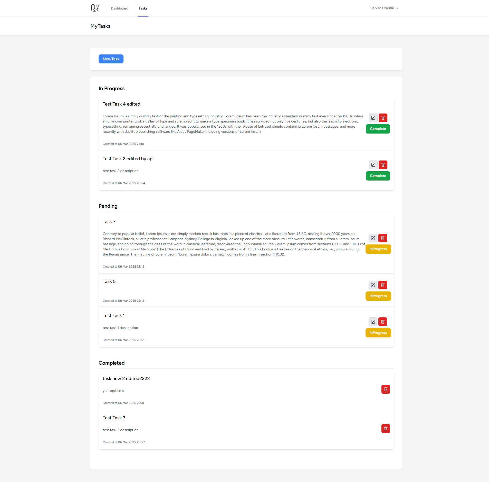

<p align="center"><a href="https://laravel.com" target="_blank" rel="nofollow"></a></p>

<p align="center">
<a href="https://github.com/berkanumutlu/challenge-laravel-task-management-system/stargazers" rel="nofollow"></a>
<a href="https://github.com/berkanumutlu/challenge-laravel-task-management-system/blob/master/LICENSE" target="_blank" rel="nofollow"></a>
<a href="https://laravel.com/docs/10.x" target="_blank" rel="nofollow"></a>
<a href="https://www.php.net/releases/8_1_23.php" target="_blank" rel="nofollow"></a>
<a href="https://dev.mysql.com/doc/relnotes/mysql/8.0/en/news-8-0-39.html" target="_blank" rel="nofollow"></a>
<a href="https://nginx.org" target="_blank" rel="nofollow"></a>
<a href="https://www.docker.com" target="_blank" rel="nofollow"></a>
<a href="https://getcomposer.org" target="_blank" rel="nofollow"></a>
</p>

# [Challenge] Task Management System

It is a basic task management system where a user can add, view and edit tasks after logging in.

## Installation

**1)** Clone repository

```shell
$ git clone https://github.com/berkanumutlu/challenge-laravel-task-management-system.git
OR
$ git clone git@github.com:berkanumutlu/challenge-laravel-task-management-system.git
```

**2)** Copy the example env file and **make the required configuration changes** in the **.env** file

```shell
$ cp .env.example .env
$ cp /project/.env.example /project/.env
```

**3)** Install docker container (required docker)

```shell
$ docker-compose up -d
```

**4)** After installation, find your app's container id on docker

```shell
$ docker ps

# Output:
CONTAINER ID   IMAGE                                           COMMAND                  CREATED        STATUS       PORTS                                            NAMES
...        
d0013e53a365   challenge-laravel-task-management-system-php8   "docker-php-entrypoi…"   20 hours ago   Up 2 hours   0.0.0.0:5173->5173/tcp, 0.0.0.0:9000->9000/tcp   laravel_task_management_system-app       
...
```

- And connect to the terminal of your app's container

```shell
$ docker exec -it {APP_CONTAINER_ID} bash
$ cd project
```

**5)** Install all the dependencies using composer and npm

```shell
$ composer install
$ npm install
```

**6)** Generate a new application key

```shell
$ php artisan key:generate
```

**7)** Run the database migrations (**Don't forget set the database connection in .env before migrating**)

```shell
$ php artisan migrate
```

**8)** Start the local development server

```shell
$ npm run dev
```

- To stop the Docker container, use the following command

```shell
$ docker-compose stop
```

**NOTE**: Every time you run the application's Docker container, you need to use the ```docker compose up``` command and
then connect to the app container's terminal and run the ```npm run dev``` command.

## Screenshots

- User Task List
  

## License

The MIT License (MIT). Please see [License File](LICENSE) for more information.